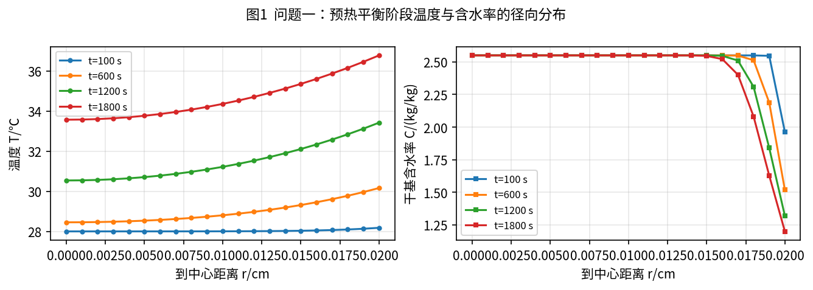
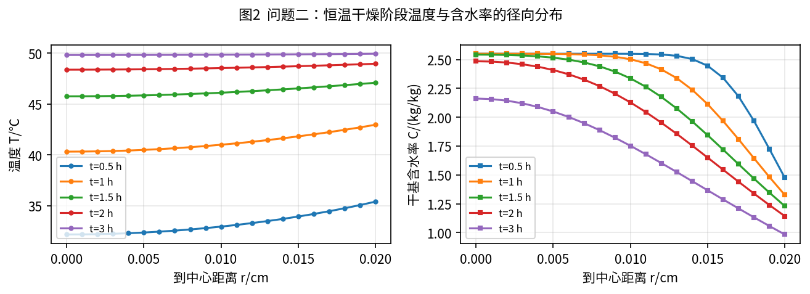
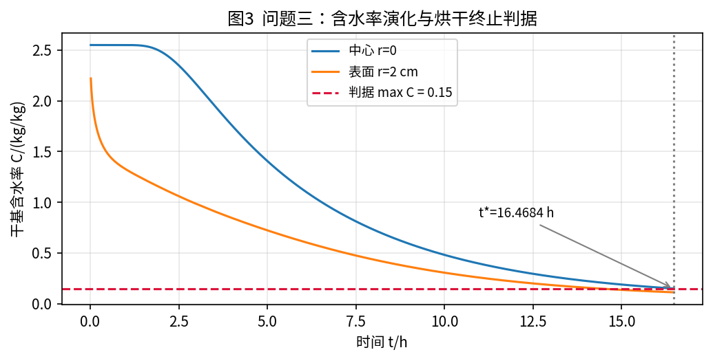
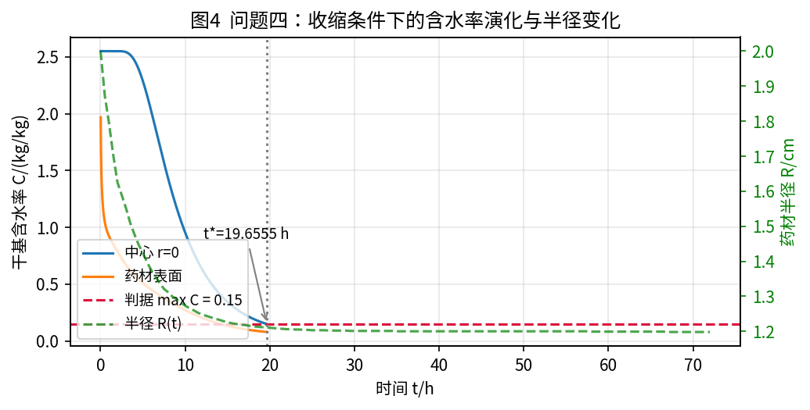
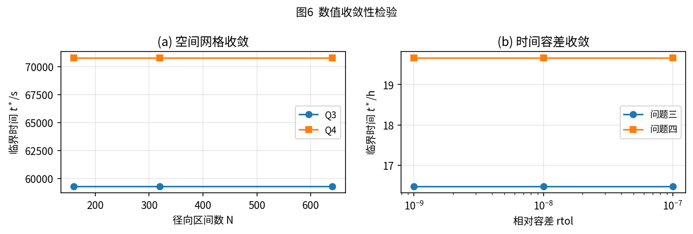
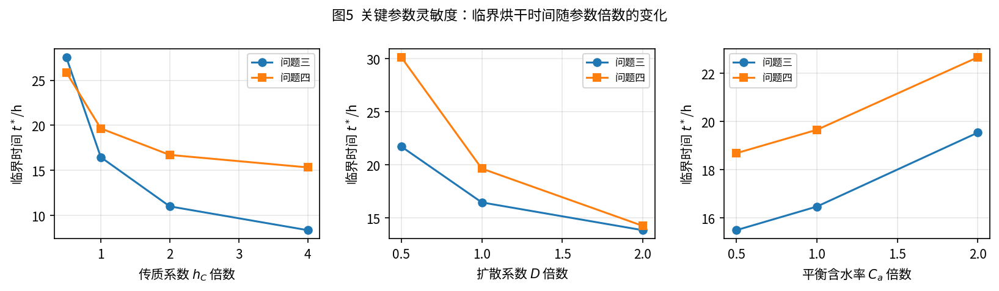

<!--
标题层级对照（供转 Word 时套用样式）：
  #    -> 论文题目（19pt 加粗）
  ##   -> 摘要标题 / 标题1（17pt 加粗）
  ###  -> 标题2（15pt 加粗）
  #### -> 标题3（13pt 加粗）
公式使用 LaTeX，编号由 \tag{n} 右对齐；正文、图、表内容与同名 docx 一致。
-->

# 基于守恒型有限体积与BDF的圆柱形药材热风烘干模型

## 摘  要

中药材热风烘干是决定成品品质与能耗的关键工序。本文针对圆柱形药材在预热平衡与恒温干燥两个阶段的温度场与含水率场演化问题，建立了径向一维轴对称的热质耦合传递模型，采用守恒型有限体积法离散空间、隐式BDF方法积分时间，对四个问题实现统一求解，并以全局含水率事件确定烘干终点。

针对问题一，在预热平衡阶段采用附录2给出的常物性参数与水分扩散系数，建立圆柱径向热传导—扩散模型，用环形控制体有限体积法离散、BDF隐式积分。计算得到30 min内药材各处的温度与水分浓度（表1、表2）：1800 s时中心温度为33.5753 ℃、表面温度为36.7856 ℃，中心水分浓度仍为2.5500 kg/kg，表面已降至1.2008 kg/kg，完整结果见result1.xlsx。

针对问题二，采用附录3的变物性经验公式，令密度、比热容、导热系数随含水率变化，扩散系数同时依赖含水率与温度，建立固定域变物性热湿耦合模型。计算表明3 h内温度迅速趋近烘房温度（3 h时表面为49.9572 ℃），而含水率由表面向中心依次下降，中心仍保持在2.1615 kg/kg（表3、表4），完整结果见result2.xlsx。

针对问题三，以全域最大含水率首次降至0.15 kg/kg作为烘干终止判据，构造事件函数并配合二分法复核。求得理论临界烘干时间为 $t^*=59286.1751\ \mathrm{s}=16.4684\ \mathrm{h}$，此时中心含水率恰为0.1500 kg/kg，该时刻之后全域含水率严格低于0.15 kg/kg（表5，result3.xlsx）。

针对问题四，引入附件2给出的收缩半径 $R(t)$，在材料坐标 $\xi=r/R(t)$ 下建立移动边界模型，使几何收缩转化为固定区间上的变系数问题。求得 $t^*=70759.9787\ \mathrm{s}=19.6555\ \mathrm{h}$（表6，result4.xlsx）。与附录4物性下的固定半径对照（39.2119 h）相比，几何收缩使干燥时间缩短约19.56 h。

模型检验表明：有限体积格式与圆柱Dirichlet解析解的最大偏差为 $7.4\times10^{-6}$；问题四在 $R(t)\equiv R_0$ 极限下与固定域结果一致到 $5.6\times10^{-16}$；空间收敛阶约为1.89~1.98；水分收支相对残差不超过 $5.5\times10^{-6}$；临界时间对网格与时间容差稳定（变化小于0.004 s）。

需要说明的是，题面所述“烘干一般持续2~3天”属于实际工艺背景。本文采用的有效扩散模型未包含蒸发潜热（温度方程无相变汇项）与吸附/解吸平衡（以空气含湿量近似表面平衡含水率），因此其预测的理论临界时间短于实际工艺时长，这属于模型简化的系统性偏差而非数值误差。

**关键词：** 热风烘干；热质耦合传递；守恒型有限体积；BDF；移动边界；全域含水率事件

## 一、问题重述

### 1.1 问题背景

干燥是决定中药材成品品质的关键工序之一，热风烘干因设备简单、易于控制而被广泛采用。该方式主要包括预热平衡与恒温干燥两个阶段，通过调控烘房温湿环境完成药材的干燥。工艺参数选取不当容易导致干燥效率低、能耗高、成品品质不稳定等问题。

本文研究的圆柱形药材长为25 cm、初始半径为2 cm，开始烘干时温度为28 ℃、干基含水率为2.55 kg/kg。仅考虑药材内部的径向变化，记 $r$ 为到药材中心的距离、$t$ 为时间、$T(r,t)$ 为药材温度、$C(r,t)$ 为干基含水率。

### 1.2 需要解决的问题

（1）问题一：建立预热平衡阶段药材温度与水分浓度变化规律的数学模型，给出100、300、600、900、1200、1500、1800 s时刻在距中心0、0.5、1、1.5、2 cm处的温度与水分浓度，并保存1800 s内每秒、每隔0.1 cm的完整结果。

（2）问题二：建立整个烘干过程（预热平衡与恒温干燥阶段参数不同）药材温度与水分浓度变化规律的数学模型，给出3 h内每0.5 h、距中心0、0.5、1、1.5、2 cm处的结果，并保存每秒、每隔0.1 cm的完整结果。

（3）问题三：确定使药材各处水分浓度均低于0.15 kg/kg所需的最短时间，并给出每隔6 h、距中心每隔0.5 cm的水分浓度与每秒、每隔0.1 cm的完整结果。

（4）问题四：考虑药材因水分流失发生的尺寸变化，根据附件2确定药材的烘干时长，并给出每隔6 h、距中心每隔0.5 cm的水分浓度与每秒、每隔0.1 cm的完整结果。

## 二、问题分析

### 2.1 总体分析

四个问题共享同一物理过程：热量由烘房空气经对流换热传入药材内部，水分由内部向表面迁移并经对流蒸发进入空气。由于药材长度远大于半径且环境沿周向、轴向均匀，可仅保留径向传递，将其简化为轴对称的一维问题。

问题的核心在于：(i) 温度与含水率通过物性和扩散系数双向耦合；(ii) 表面为Robin型换热与传质边界；(iii) 问题三、四需要以全域含水率阈值自动判定终止时刻；(iv) 问题四的域边界随时间收缩，必须采用移动边界处理。因此本文采用统一的守恒型有限体积法离散空间，用隐式BDF方法积分时间，并用事件机制确定终止时刻。

### 2.2 问题一分析

预热平衡阶段（0~1800 s）药材尚未明显脱水，附录2给出常物性与仅依赖含水率的水分扩散系数，故可视为常系数圆柱径向热传导—扩散问题。烘房温度由28 ℃缓慢升至41.5 ℃，被处理为随时间变化的环境函数。药材热扩散率约为 $1.69\times10^{-7}\ \mathrm{m^2/s}$，热平衡时间常数约15 min，因此30 min内温度场基本跟随环境变化而含水率仅表层明显下降。

### 2.3 问题二、问题三分析

恒温干燥阶段必须使用附录3的变物性经验公式：密度、比热容、导热系数均为含水率的函数，扩散系数同时随含水率与绝对温度变化。此时温度场与含水率场强耦合，方程组刚性较强，适合隐式方法求解。问题三在问题二的基础上延长积分时间，以全域最大含水率首次降至0.15 kg/kg的时刻作为烘干终点。由于表面始终比内部干燥得快，最大含水率位于中心，该判据等价于中心含水率达标。

### 2.4 问题四分析

药材收缩使半径由2 cm减小到约1.198 cm，域边界随时间移动。本文引入材料坐标 $\xi=r/R(t)\in[0,1]$，把移动域问题转化为固定区间上的变系数偏微分方程，避免显式处理网格移动速度。输出时按 $\xi_k(t)=r_k/R(t)$ 把材料坐标结果映射回固定物理位置，位于药材之外的物理点留空。

## 三、模型假设

（1）药材为均匀、各向同性的圆柱体，忽略周向与轴向梯度，仅考虑径向传递。

（2）烘房环境均匀，药材表面各处的温度与水分交换条件相同。

（3）含水率以干基含水率度量，其扩散符合Fick定律，并可由有效扩散系数描述。

（4）水分在药材内部的迁移以液相扩散为主，忽略毛细流动、蒸发—冷凝的微观再分布。

（5）不考虑辐射换热、化学反应、表面硬化与裂纹等次要因素。

（6）问题一至问题三药材尺寸不变；问题四的收缩为各向同性的径向相似收缩，即 $r=\xi R(t)$。

（7）由于题目未给出吸附等温线，取烘房空气含湿量作为药材表面的等效平衡含水率。

## 四、符号说明

**表0  主要符号说明**

| 符号 | 说明 | 单位 |
|---|---|---|
| $r$ | 到药材中心的距离 | m |
| $R(t)$ | 药材半径（问题四随时间变化） | m |
| $t$ | 时间 | s |
| $T(r,t)$ | 药材温度 | ℃ |
| $C(r,t)$ | 干基含水率 | kg/kg |
| $T_a$、$C_a$ | 烘房温度、空气含湿量 | ℃、kg/kg |
| $\rho$ | 密度 | kg/m³ |
| $c_p$ | 比热容 | J/(kg·K) |
| $k$ | 导热系数 | W/(m·K) |
| $D$ | 水分扩散系数 | m²/s |
| $h_T$ | 对流换热系数 | W/(m²·K) |
| $h_C$ | 对流传质系数 | m/s |
| $\xi$ | 材料坐标，$\xi=r/R(t)$ | — |
| $g(t)$ | 全域含水率事件函数 | kg/kg |

## 五、模型建立与求解

### 5.1 控制方程

在轴对称圆柱假设下，控制体取单位轴向长度的环形薄层。能量与质量守恒分别给出

$$
\rho c_p \frac{\partial T}{\partial t}
= \frac{1}{r}\frac{\partial}{\partial r}\left( r k \frac{\partial T}{\partial r} \right)
\tag{1}
$$

$$
\frac{\partial C}{\partial t}
= \frac{1}{r}\frac{\partial}{\partial r}\left( r D \frac{\partial C}{\partial r} \right)
\tag{2}
$$

式中右侧为径向散度形式的守恒通量，导热系数 $k$ 与扩散系数 $D$ 均使用当前局部状态计算。边界条件为：

### 5.2 环境条件与初始条件

附件1给出烘干初期每隔60 s的烘房温度与空气含湿量（0~14400 s，共241个数据点）。在数据区间内采用分段线性插值构造环境函数 $T_a(t)$、$C_a(t)$；4 h之后附件1不再提供数据，取其中最后1 h（10800~14400 s，61个数据点）的均值外推，得 $T_a=49.998934\ ℃$、$C_a=0.04998754\ \mathrm{kg/kg}$。

药材的初始状态为 $T(r,0)=28\ ℃$、$C(r,0)=2.55\ \mathrm{kg/kg}$；中心处由对称性给出 $\partial T/\partial r=\partial C/\partial r=0$。

### 5.3 边界条件

药材表面与烘房空气之间为对流换热与对流传质，边界条件为

$$
-k\left.\frac{\partial T}{\partial r}\right|_{r=R} = h_T \left( T_s - T_a \right)
\tag{3}
$$

$$
-D\left.\frac{\partial C}{\partial r}\right|_{r=R} = h_C \left( C_s - C_a \right)
\tag{4}
$$

其中 $T_s$、$C_s$ 为表面温度与表面含水率。由边界条件与内部扩散的相对强弱可估计传质Biot数约为1.1，说明干燥过程同时受内部扩散与表面传质控制。

### 5.4 问题一：常物性预热平衡模型

采用附录2的参数：$\rho=820\ \mathrm{kg/m^3}$、$c_p=2600\ \mathrm{J/(kg\cdot K)}$、$k=0.36\ \mathrm{W/(m\cdot K)}$、$h_T=25\ \mathrm{W/(m^2\cdot K)}$、$h_C=8\times10^{-7}\ \mathrm{m/s}$，水分扩散系数为

$$
D(C) = 7\times10^{-9} \exp(-0.89C) \quad (\mathrm{m^2/s})
\tag{5}
$$

该阶段半径固定为 $R_0=0.02\ \mathrm{m}$。以守恒型有限体积法求解后，得到30 min内的温度与水分浓度分布，如表1、表2所示。

**表1  30分钟内药材的温度（℃）**

| 时间/s | 0 | 0.5 | 1 | 1.5 | 2 |
|---|---|---|---|---|---|
| 100 | 28.0001 | 28.0003 | 28.0040 | 28.0327 | 28.1801 |
| 300 | 28.0408 | 28.0635 | 28.1514 | 28.3681 | 28.8488 |
| 600 | 28.4533 | 28.5360 | 28.8039 | 29.3159 | 30.1652 |
| 900 | 29.3243 | 29.4583 | 29.8755 | 30.6161 | 31.7304 |
| 1200 | 30.5427 | 30.7098 | 31.2223 | 32.1126 | 33.4276 |
| 1500 | 31.9957 | 32.1867 | 32.7660 | 33.7463 | 35.1203 |
| 1800 | 33.5753 | 33.7720 | 34.3642 | 35.3621 | 36.7856 |

**表2  30分钟内药材的水分浓度（kg/kg）**

| 时间/s | 0 | 0.5 | 1 | 1.5 | 2 |
|---|---|---|---|---|---|
| 100 | 2.5500 | 2.5500 | 2.5500 | 2.5500 | 1.9628 |
| 300 | 2.5500 | 2.5500 | 2.5500 | 2.5500 | 1.7050 |
| 600 | 2.5500 | 2.5500 | 2.5500 | 2.5500 | 1.5183 |
| 900 | 2.5500 | 2.5500 | 2.5500 | 2.5500 | 1.4030 |
| 1200 | 2.5500 | 2.5500 | 2.5500 | 2.5498 | 1.3196 |
| 1500 | 2.5500 | 2.5500 | 2.5500 | 2.5489 | 1.2543 |
| 1800 | 2.5500 | 2.5500 | 2.5500 | 2.5463 | 1.2008 |

由表1可见，预热阶段温度场沿径向存在小幅梯度，1800 s时中心与表面温差约3.2 ℃，整体温度随烘房升温而稳步上升；由表2可见，水分浓度在中心区域基本不变，仅表面附近明显下降，1800 s时表面水分浓度已降至1.2008 kg/kg，说明30 min内水分变化仍局限于表层。完整结果（每秒、每隔0.1 cm）见result1.xlsx。

### 5.5 问题二：变物性恒温干燥模型

恒温干燥阶段采用附录3的经验公式，物性随含水率变化：

$$
\rho(C)=650+128C,\qquad c_p(C)=1450+2736\frac{C}{C+1},\qquad k(C)=0.21+0.38\frac{C}{C+1}
\tag{6}
$$

$$
D(C,T_K) = 2.4\times10^{-3} \exp(-0.45C)\exp\left(-\frac{3850}{T_K}\right)
\tag{7}
$$

其中 $T_K=T+273.15$ 为绝对温度。该式中的温度指数采用绝对温度的倒数形式，与附录给出的经验形式一致。由于题目规定预热与恒温阶段参数不同，本文把问题二视为从初始时刻起、以附录3物性描述的整个烘干过程，即 $T(r,0)=28\ ℃$、$C(r,0)=2.55\ \mathrm{kg/kg}$。

方程(1)(2)与物性(6)(7)构成强耦合非线性系统。求解得到3 h内的温度与水分浓度分布，如表3、表4所示。

**表3  3小时内药材的温度（℃）**

| 时间/h | 0 | 0.5 | 1 | 1.5 | 2 |
|---|---|---|---|---|---|
| 0.5 | 32.1796 | 32.3718 | 32.9533 | 33.9439 | 35.4080 |
| 1.0 | 40.3269 | 40.4984 | 41.0051 | 41.8275 | 42.9699 |
| 1.5 | 45.7675 | 45.8575 | 46.1221 | 46.5465 | 47.1012 |
| 2.0 | 48.3870 | 48.4270 | 48.5438 | 48.7289 | 48.9716 |
| 2.5 | 49.4313 | 49.4449 | 49.4829 | 49.5399 | 49.6422 |
| 3.0 | 49.8327 | 49.8390 | 49.8598 | 49.8978 | 49.9572 |

**表4  3小时内药材的水分浓度（kg/kg）**

| 时间/h | 0 | 0.5 | 1 | 1.5 | 2 |
|---|---|---|---|---|---|
| 0.5 | 2.5500 | 2.5500 | 2.5494 | 2.4460 | 1.4754 |
| 1.0 | 2.5499 | 2.5484 | 2.5022 | 2.1127 | 1.3263 |
| 1.5 | 2.5423 | 2.5159 | 2.3365 | 1.8441 | 1.2299 |
| 2.0 | 2.4846 | 2.4089 | 2.1281 | 1.6502 | 1.1426 |
| 2.5 | 2.3491 | 2.2419 | 1.9309 | 1.4970 | 1.0600 |
| 3.0 | 2.1615 | 2.0493 | 1.7522 | 1.3667 | 0.9837 |

由表3可见，由于药材热容较小而表面对流换热充分，温度在1 h内即迅速接近烘房温度，3 h时表面温度为49.9572 ℃，径向温差不足0.13 ℃。由表4可见，水分浓度自表面向中心依次下降，中心因扩散路径最长而干燥最慢，3 h时中心仍为2.1615 kg/kg、表面已降至0.9837 kg/kg。完整结果见result2.xlsx。

### 5.6 问题三：全域含水率终止事件

问题三沿用问题二的控制方程与物性。定义全域最大含水率与事件函数

$$
g(t) = \max_{0\le r\le R_0} C(r,t) - 0.15
\tag{8}
$$

理论临界烘干时间为 $g(t)$ 首次由正变负的时刻，即

$$
t^* = \inf\left\{\, t \ge 0 \;:\; \max_{r} C(r,t) \le 0.15 \,\right\}
\tag{9}
$$

数值实现中，事件函数采用节点最大含水率 $\max_i C_i-0.15$，并设置终止方向为负，由BDF求解器在内部稠密插值上定位临界时刻，再以二分法在事件前后的异号区间上复核。求得临界烘干时间与相应分布如表5所示。

**表5  药材烘干过程的水分浓度（kg/kg）**

| 时间/h | 0 | 0.5 | 1 | 1.5 | 2 |
|---|---|---|---|---|---|
| 6 | 1.1258 | 1.0823 | 0.9639 | 0.7984 | 0.6145 |
| 12 | 0.3246 | 0.3169 | 0.2947 | 0.2604 | 0.2175 |
| 16.4684 | 0.1500 | 0.1474 | 0.1399 | 0.1280 | 0.1128 |

计算得 $t^* = 59286.1751\ \mathrm{s} = 16.4684\ \mathrm{h}$。此时中心含水率恰为0.1500 kg/kg，该时刻之后全域含水率严格低于0.15 kg/kg。由表5可见，烘干前12 h含水率下降较快，此后由于传质推动力减小、干燥速率降低，中心由0.3246 kg/kg进一步降至0.1500 kg/kg又耗时约4.5 h。完整结果见result3.xlsx。

### 5.7 问题四：收缩材料坐标模型

药材在干燥过程中体积收缩，附件2给出半径随时间的变化，由2 cm单调减小至约1.198 cm。引入材料坐标 $\xi=r/R(t)$，把移动域映射为固定区间 $[0,1]$，记 $\theta(\xi,t)=T(\xi R(t),t)$、$c(\xi,t)=C(\xi R(t),t)$，则控制方程化为

$$
\rho(c)c_p(c)\frac{\partial \theta}{\partial t}
= \frac{1}{R(t)^2\xi}\frac{\partial}{\partial \xi}
\left( \xi k(c)\frac{\partial \theta}{\partial \xi} \right)
\tag{10}
$$

$$
\frac{\partial c}{\partial t}
= \frac{1}{R(t)^2\xi}\frac{\partial}{\partial \xi}
\left( \xi D(c,\theta+273.15)\frac{\partial c}{\partial \xi} \right)
\tag{11}
$$

物性采用附录4的经验公式：

$$
\rho(c)=760+90c,\qquad c_p(c)=1850+2150\frac{c}{c+1},\qquad k(c)=0.12+0.20\frac{c}{c+1}
\tag{12}
$$

$$
D(c,\theta_K) = 4.2\times10^{-4}\exp(-0.30c)\exp\left(-\frac{3850}{\theta_K}\right)
\tag{13}
$$

表面边界条件在材料坐标下写为

$$
-\frac{k(c_s)}{R(t)}\theta_\xi(1) = h_T(\theta_s-T_a),\qquad
-\frac{D}{R(t)}c_\xi(1) = h_C(c_s-C_a)
\tag{14}
$$

径向半径由附件2数据经保形单调插值（PCHIP）得到，避免出现非单调与过冲。终止判据与问题三相同，但取材料坐标下的最大值：

$$
g_4(t) = \max_{0\le \xi\le 1} c(\xi,t) - 0.15
\tag{15}
$$

求解后按 $\xi_k(t)=r_k/R(t)$ 映射回固定物理位置输出，位于药材之外的位置留空，并单列药材表面含水率，结果如表6所示。

**表6  药材烘干过程的水分浓度（kg/kg）**

| 时间/h | 0 | 0.5 | 1 | 1.5 | 2 | 药材表面 |
|---|---|---|---|---|---|---|
| 6 | 2.0185 | 1.7058 | 0.9917 | | | 0.4526 |
| 12 | 0.6313 | 0.5401 | 0.3243 | | | 0.2054 |
| 18 | 0.1972 | 0.1757 | 0.1214 | | | 0.0940 |
| 19.6555 | 0.1500 | 0.1355 | 0.0987 | | | 0.0802 |

计算得 $t^* = 70759.9787\ \mathrm{s} = 19.6555\ \mathrm{h}$。由表6可见，随半径收缩，距中心1.5、2.0 cm的物理位置先后落到药材之外因而留空；药材表面含水率持续降低，至临界时刻为0.0802 kg/kg，而中心含水率恰为0.1500 kg/kg。

为分离几何收缩的影响，另以附录4物性固定半径 $R(t)\equiv0.02\ \mathrm{m}$ 进行对照计算，得烘干时间为39.2119 h。可见在相同物性下，纯几何收缩使干燥时间缩短约19.56 h，原因是收缩缩短了水分扩散距离并增大了表面的相对交换能力。

## 六、模型检验与灵敏度分析

### 6.1 数值验证

为验证离散格式与实现的正确性，进行了四组检验。

（1）解析解验证。构造常扩散系数、表面为Dirichlet条件的圆柱合成问题，与贝塞尔级数解析解对比，最大绝对偏差为 $7.4\times10^{-6}$。

（2）极限一致性验证。令问题四中的 $R(t)\equiv R_0$ 并使用与固定域相同的物性，材料坐标程序与固定域程序的结果偏差为 $5.6\times10^{-16}$，达到机器精度。

（3）网格与时间容差收敛。取径向区间数 $N=160$、320、640，临界时间分别为59286.102、59286.175、59286.194 s（问题三）与70760.077、70759.979、70759.952 s（问题四），估计空间收敛阶约为1.98与1.89，接近二阶；相对容差取 $10^{-7}$、$10^{-8}$、$10^{-9}$ 时，临界时间变化小于0.003 s。综合时间积分与空间离散，$N=320$ 时临界时间的不确定度约为0.04 s以内。

（4）守恒性检验。对含水率总量做收支核算，Q1、Q3、Q4的相对残差分别为 $3.83\times10^{-9}$、$2.97\times10^{-6}$、$5.54\times10^{-6}$；其中问题四采用材料坐标度量，以避免把几何收缩误判为水分流失。

### 6.2 灵敏度分析

考虑到经验公式与工艺参数存在不确定性，对表面传质系数 $h_C$、扩散系数 $D$ 和边界平衡含水率 $C_a$ 进行了系统灵敏度分析，结果见表7。

**表7  关键参数的灵敏度（临界时间，h）**

| 变化因素 | 倍数 | 问题三 | 问题四 |
|---|---|---|---|
| 传质系数 $h_C$ | ×0.5 | 27.5524 | 25.8758 |
|  | ×1.0 | 16.4684 | 19.6555 |
|  | ×2.0 | 11.0138 | 16.7220 |
|  | ×4.0 | 8.3730 | 15.3377 |
| 扩散系数 $D$ | ×0.5 | 21.7312 | 30.1445 |
|  | ×2.0 | 13.8514 | 14.2591 |
| 平衡含水率 $C_a$ | ×0.5 | 15.4884 | 18.6852 |
|  | ×2.0 | 19.5391 | 22.6682 |

结果表明：临界时间对表面传质系数与扩散系数最为敏感，传质系数减小一半会使问题三的烘干时间由16.47 h延长到27.55 h；对边界平衡含水率的敏感度中等；4 h之后环境取恒定50 ℃或取附件1末值，对结果的影响均不足0.2%，说明环境外推方式不构成主要不确定性。

### 6.3 结果合理性讨论

由计算结果可见，温度场在1 h内即接近烘房温度，而含水率的下降贯穿整个干燥过程，这与热风干燥中“热扩散快、质扩散慢”的一般规律一致；含水率始终由中心向表面单调递减，最大含水率恒位于中心，符合内部扩散控制的物理图像。

题面指出烘干过程一般持续2~3天。本文模型给出的理论临界时间为16.47 h（固定尺寸）与19.66 h（考虑收缩），短于实际工艺时长。其原因是本文采用的有效扩散模型未包含蒸发潜热与吸附/解吸平衡等机制：温度方程中没有相变潜热汇项，药材升温偏快、扩散系数偏大；同时以空气含湿量直接作为表面平衡含水率，缺少吸附等温线。因此该差值属于模型简化的系统性偏差，而非数值实现错误。

## 七、模型优缺点评价

### 7.1 模型优点

（1）采用守恒型有限体积法离散，通量形式保证离散后的质量与能量严格守恒，中心界面面积为零，天然满足对称条件，无需虚拟节点。

（2）使用隐式BDF方法积分刚性耦合方程组，并通过稀疏Jacobian结构提高效率，可在毫秒级完成单次求解。

（3）问题四采用材料坐标把移动边界问题转化为固定区间问题，避免了网格移动与对流项的显式处理。

（4）终止时刻由事件机制自动定位并以二分法复核，且给出了网格、容差、守恒与灵敏度等完整验证。

### 7.2 模型缺点与改进方向

（1）模型未考虑蒸发潜热与吸附平衡，预测的临界时间偏短；后续可引入相变源项与吸附等温线以提高与实际工艺的吻合度。

（2）物性经验公式中温度项采用绝对温度倒数形式，若按字面代入摄氏度或绝对温度将导致扩散系数下溢，本文采用了合理的物理解释。

（3）模型仅保留径向传递，忽略了轴向与端面效应，对长径比较小的药材需引入二维模型。

## 参考文献

[1] Eymard R, Gallouët T, Herbin R. Finite Volume Methods[M]. Handbook of Numerical Analysis, Vol. VII. Amsterdam: North-Holland, 2000.

[2] Gasparin S, Berger J, Dutykh D, et al. Reliable numerical schemes for a nonlinear heat and moisture transfer problem[J]. Applied Mathematics and Computation, 2017.

[3] Mayor L, Sereno A M. Modelling shrinkage during convective drying of food materials: a review[J]. Journal of Food Engineering, 2004, 61(3): 373-386.

[4] Seyedabadi E, Khojastehpour M, Sadrnia H, et al. Finite element modeling of convective drying of banana with radial shrinkage using the ALE method[J]. Journal of Food Science and Technology, 2016.

[5] Virtanen P, Gommers R, Oliphant T E, et al. SciPy 1.0: fundamental algorithms for scientific computing in Python[J]. Nature Methods, 2020, 17: 261-272.

## 附录

#### 附录1  支撑文件列表

本论文计算结果由如下文件保存：result1.xlsx（问题一，温度与水分浓度，1~1800 s、每隔0.1 cm）；result2.xlsx（问题二，1~10800 s）；result3.xlsx（问题三，每秒60 s，含临界时刻行）；result4.xlsx（问题四，含药材表面列与药材外部留空）。验证与诊断数据见 outputs/diagnostics 目录。

#### 附录2  主要程序

计算程序基于 Python 3.12 编写，使用 NumPy、SciPy 与 openpyxl。核心流程为：读取附件数据并校验，构造环境函数与半径函数，按守恒型有限体积法装配右端函数，用 solve_ivp（BDF）积分并监测终止事件，最后按模板写出四位小数的结果文件。主要源程序见随论文提交的源代码包。
